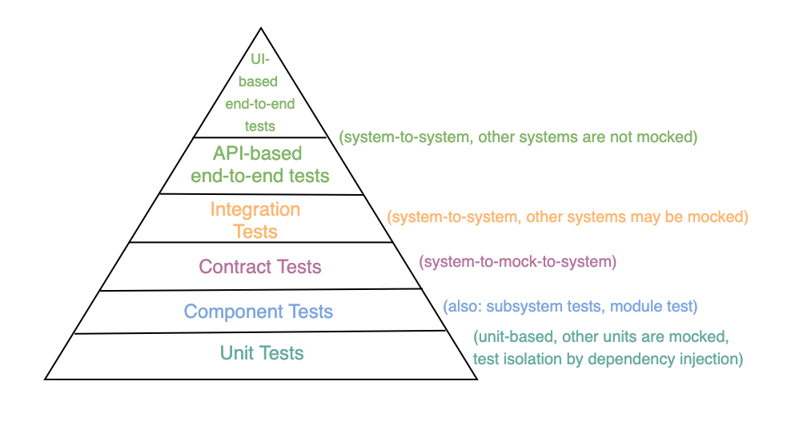
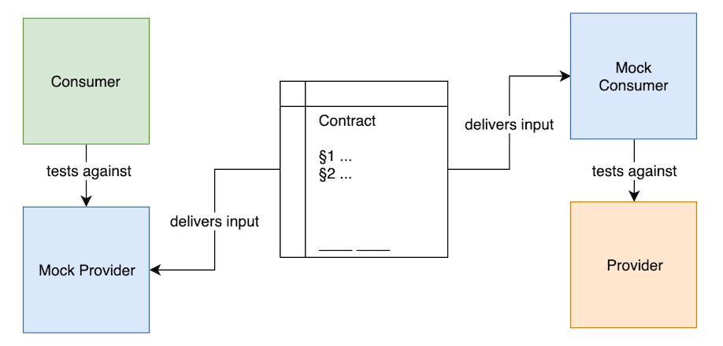

# Consumer-driven contract testing with Pact

## Introduction

When deploying microservices or any other distributed system, one has to deal with a multitude of interfaces between the single services in place. Classical end-to-end tests require a test environment providing all services at the same time. However, testing HTTP/REST communication between these services can quickly turn into tedious work if one of the involved systems changes. This "expensive" testing strategy is reasonable for entire flows, but is not the best way for API focussed tests where one consumer expects a specific response from one producer. This is wher Consumer-driven contract tests come into play: interactions between services are tested more independently in a decoupled fashion. It does not entirely replace end-to-end tests, but it will speed up development for APIs as it focusses on interactions between consumers and producers.

This blog post will illuminate the concept of consumer-driven tests. After discussing topics like test pyramid, naming test types and the core mechanism behind Pact including common questions, we will introduce an example with Pact for JUnit 5 to showcase the basic test setup in JVM based environments. The closing section will briefly deal with the advantages and disadvantages of Pact.

## Why consumer-driven tests?

### Test Pyramid and when to avoid expensive tests

Before delving into consumer-driven tests with Pact, we first should clarify why we would need it. This question can be answered by taking a short look at the "test pyramid". This term is a metaphor that tells us how to group tests into various buckets with different granularity. 

In the [original concept](https://martinfowler.com/articles/practical-test-pyramid.html) coined by [Mike Cohn](https://en.wikipedia.org/wiki/Mike_Cohn) there were basically three layers from bottom to top: UI tests, service tests and unit tests. 


Unit tests ideally run for a short time and provide a high degree of isolation. Interactions with other units are usually mimicked by using test doubles such as fakes, mocks and stubs <a href="#footnote_01" id="back_01"><sup>1</sup></a>. As they can be easily automated without complex infrastructure they form the basis of any test strategy and cover a high proportion of the source code. In contrast to that, service tests require a more elaborate set-up than unit tests as different components must be brought into a condition suitable for testing interactions and integrative aspects. E. g. if a database is tested, it must be filled with appropriate test data first. In addition, they are more vulnerable to unforseen test failures because they are affected by code changes in more than one component. UI tests verify if the user interface of your application works correctly: User input should trigger the right actions and data should be presented to the user.

Things have changed a bit since the first concept of the test pyramid. Back then tools like [Selenium](https://www.seleniumhq.org/) were used for both testing user interfaces and end-to-end integration. Today the term UI test is often used very unspecifically so it also covers UI component tests and UI application tests with mocked backends. Actually UI applications have their own test pyramid.

Beyond that system tests are often subdivided into integration tests, contract tests and component tests. Beware of confusion: There is no standardized wording for the different test types so that you cannot rely on a common understanding of terminology. Some say these kinds of (system) tests are all integration tests, some say they are all component tests. Either way the terms sometimes conflate. Software engineers will argue endlessly about wording and definitions and often this tedious discussion is a big source of confusion <a href="#footnote_02" id="back_02"><sup>2</sup></a>.

However, the boundaries between different test categories is fluent and it is perfectly okay to use your own terminology as long as they are part of the "ubiquitous language" in the sense of domain driven design. In other words: make sure that everyone has the same understanding in your company unit. The pyramid used in this blog post offers a taxonomy as a starting point for your own terminology.



End-to-end tests assume a true application on a fully functional test system. They give you the biggest confidence when to decide if your software is working or not as they simulate a real user better than other test types. However, one buys the benefits of end-to-end testing at a high price as the set-up is much more complex than that of integration or unit tests as it requires a complete system in which each and every service runs with the associated database.

In a distributed architecture a high degree of automation is required, so setting up a working full environment might be demanding but it has to be done anyway. However, one goal of CI is that changes to the code are checked promptly, indicating whether the changes have led to errors or not. Starting a complete test environment for end-to-end tests leads to longer execution time, and for some tests the feedback usually comes too late. Truthfully, it is not desirable to run fully fledged end-to-end test for every code change. For example, when you use the Gitflow feature branch model, each change in every feature branch in each service would require a separate test environment in a fashion that they don't get in each other's way. Having said that, end-to-end tests make perfect sense for certain scenarios but not for changed API call responses where quick feedback is desired. 

### Why not use integration tests then?

Of course one can think of setting up a test environment with one consumer talking to one producer. However, the producer might be dependent on other services and both providing a complete working environment is exactly what we wanted to avoid (integration test degenerate into full-blown end-to-end tests). Apart from that the producer might not be under control of the team building the test. So one thing you can do is mock the producer and validate the consumer against the mocked endpoints using a framework such as [REST-assured](http://rest-assured.io/). At first glance this approach is valid as it mitigates the pain of waiting for desired changes on the producer's side: We can add e. g. an additional field in the desired response by changing the mock implementation and swiftly go on implementing changes in the consumer. However, the desired changes for the producer have to be communicated. When executing the real end-to-end test this test might break as there is no guarantee if and when the change request is implemented in the producer. And in case the end-to-end test does not cover the required change, the build-wall remains green, then the software is deployed and finally the system in production will fail <a href="#footnote_03" id="back_03"><sup>3</sup></a>.

So this is where consumer-driven contract tests come to the scene: they provide a mock producer (called mock provider), facilitate change requests between teams and make sure that a consumer can only be deployed when the changes necessary are implemented in the producer.

## Basic Pact concepts

Pact is the standard framework for consumer-driven contract testing. Besides JVM languages such as Java, Kotlin, and Scala (all via JUnit) there are also implementations for JavaScript, Python, Go, Swift, .NET, and Ruby.

### Terminology

Consumer-driven contract testing with Pact uses different terms and concepts:

- **Consumer:** A service/component consuming data from another service e. g. via a HTTP/REST API call, independent of the data flow direction (it does not matter if the HTTP request is a GET, PUT, POST, PATCH or DELETE).
- **Provider:** A service/component providing data to another service e. g. via a HTTP/REST interface. It may have more than one HTTP endpoint. It is semantically the same as the aforementioned producer. ***From this point on, we will use the term provider instead of producer.*** One producer can have more than one provider.
- **Mock Service Provider:** Used by tests in the consumer pipeline to mock the actual provider. Integration-like tests can be run without the actual provider.
- **Interaction:** A request and response pair. 
- **Contract (or Pact file):** A contract consists of a collection of interactions. Actually it is a file containing serialized interactions generated by the consumer test. In addition it defines the consumer name, provider name, metadata with the pact specification version and the pact verfication.
- **Pact verfication:** A Pact file is verified by replaying the requests against the (real) provider, the responses must match those in the Pact file.
- **Provider state:**: It is basically a "[fixture](https://stackoverflow.com/questions/12071344/what-are-fixtures-in-programming) name" such as "when user Joe Doe exists" and describes the state that the provider should be in when a given request is replayed.
- **Pact specification:** It is a [document](https://github.com/pact-foundation/pact-specification) describing the structure of the generated Pact file, allowing for interoperability between different languages/Pact implementations.
- **Pact broker:** The Pact Broker is a central application for sharing for consumer driven contracts and verification results. It is optimised for use with Pact.

### Workflow and tests

Before going into detail of the tests we first provide a 10000 feet view of the contract test workflow. A contract includes example requests and responses that serve as input for a mock provider and a mock consumer against which the interface partners can be tested independently. Instead of testing the interface with an end-to-end test that requires both the real provider and consumer, two tests are performed on each side of the interface without direct dependency to the other side:



### Comsumer test

This is all about consumer-driven contract testing, so let's examine the consumer test first. Before executing the actual consumer test, the initial step is to specify all interactions (we remember: collections of expected requests and responses) that are later included in the Pact file. While it is possible to manually create and modify Pact files with any editor of your choice, we highly encourage you to create/modify them automatically based on whatever DSL provided by your Pact framework. This is usually done inside the consumer test. The other task of the consumer test is to execute tests against the Pact mock provider with which the interactions of the Pact file are registered. This is done by real requests fired against the mock provider. The mock provider itself is also generated by the Pact framework. Then both the actual and expected requests are compared with each other, indicating if the response was correct or not <a href="#footnote_04" id="back_04"><sup>4</sup></a>. After successfully building the consumer the generated Pact file is uploaded to a central place, e. g. to Pact broker.

We will later see in the hands-on chapter how to define interactions and write consumer tests with the Pact framework extension for JUnit 5.


### Provider test

Provider tests serve for the provider verification where each request is sent to the (real) provider, and the actual response generated is compared with the minimal expected response described in the contract. It is deliberatly called "minimal expected response" as there may not only be different consumers for different endpoints but also different consumers for one endpoint, so it is sufficient for the verification if the requierd subset is in the response <a href="#footnote_05" id="back_05"><sup>5</sup></a>. The verification passes if each request fulfills this requirement. In many cases the provider has to be in a particular state (see description above). The Pact frameworks supports this by letting you set up the data described in the provider state before the interaction is replayed.

If the provider wants to change its API by e. g. adding an additional attribute to the response, it can simply verify all existing contracts. If the verification is successful, the changes should not break any of the consumers.


## Implementing Pact tests for the JVM with JUnit 5

So this is the hands-on part of the blog post. The toy application provided alongside this blog post was originally a POC for Ktor <a href="#footnote_06" id="back_06"><sup>6</sup></a>. Apart from Docker it requires Java 11 so make sure to point your JAVA_HOME environment variable to the right directory. You can get the tyo application from [here](https://github.com/eon-com/toyapp-pact-demo). After the download please run `./build.sh` (using Terminal on macOS, Linux or [Git BASH](https://gitforwindows.org/) on Windows) in order to see if everything works as expected. Please make sure that port 8080 on your local machine is available.

### Project structure

You will find the following project structure: 

- common: some cross cutting code shared between the other services
- core-data-service: a service with core customer data used by other services
- customer-service: uses a subset from data provided by core-data-service
- creditcheck: uses a different subset from data provided by core-data-service

The data provided by the core-data-service will look like this:

```json
[
  {
    "id": 555,
    "first_name": "Arnold",
    "last_name": "Schwarzenegger",
    "date_of_birth": "1947-07-30",
    "address": {
      "street": "P.O. Box 1234",
      "number": "--",
      "zip_code": "CA 90406",
      "place": "Santa Monica",
      "country": "US"
    }
  },
  {
    "id": 666,
    "first_name": "Bruce",
    "last_name": "Willis",
    "date_of_birth": "1955-03-19"
  },
  {
    "id": 777,
    "first_name": "Sylvester",
    "last_name": "Stalone",
    "date_of_birth": "1946-07-06"
  }
]
```

### Prerequisites for Maven

As we decided to use Maven for our toy application we have to do quite a few things first. First of all we use the latest and greates **failsafe** and **surefire** plugin version, in our case **3.0.0-M3**. It supports both JUnit 5 and the Pact version we use. As opposed to a real world microservice scenario we have the luxury to run a multimodule Maven project, that is why we put the following snippet in our parent POM file inside the propierties- and pluginManagement-section to avoid having this boilerplate in each and every module:

```xml
<project>
    <properties>
        <!-- [...] -->
        <failsafe-surefire.version>3.0.0-M3</failsafe-surefire.version>
        <!-- [...] -->
        <pact.dir>target/pacts</pact.dir>
        <pact.broker.schema>http</pact.broker.schema>
        <pact.broker.host>localhost</pact.broker.host>
        <pact.broker.port>8080</pact.broker.port>
    </properties>
    <!-- [...] -->
    <build>
        <!-- [...] -->
        <pluginManagement>
            <plugins>
                <!-- [...] -->
                <plugin>
                    <artifactId>maven-surefire-plugin</artifactId>
                    <version>${failsafe-surefire.version}</version>
                    <dependencies>
                        <dependency>
                            <groupId>org.junit.jupiter</groupId>
                            <artifactId>junit-jupiter-engine</artifactId>
                            <version>${junit.version}</version>
                        </dependency>
                    </dependencies>
                    <configuration>
                        <systemPropertyVariables>
                            <pact.rootDir>${pact.dir}</pact.rootDir>
                            <pact.verifier.publishResults>true</pact.verifier.publishResults>
                        </systemPropertyVariables>
                    </configuration>
                </plugin>
                <plugin>
                    <artifactId>maven-failsafe-plugin</artifactId>
                    <version>${failsafe-surefire.version}</version>
                </plugin>
            </plugins>
            <plugin>
                <groupId>au.com.dius</groupId>
                <artifactId>pact-jvm-provider-maven</artifactId>
                <version>4.0.0-beta.5</version>
                <configuration>
                    <serviceProviders/>
                    <pactDirectory>${pact.dir}</pactDirectory>
                    <pactBrokerUrl>${pact.broker.schema}://${pact.broker.host}:${pact.broker.port}</pactBrokerUrl>
                    <tags>
                        <tag>master</tag>
                    </tags>
                </configuration>
            </plugin>
        </pluginManageement>
    </build>
</project>
```

Please keep in mind this is an example application only. It's perfeclty up to you how to inject your properties based on the currently used enviroment.

A closer look at the configuration for **pact-jvm-provider-maven** reveals there is also the optional possibility to define tags. Dealing with tags in a detailed manner would go beyond the scope of this blog post; hence we discuss it just briefly: if both consumer and provider use the same tag it will facilitate implementing your user stories as the provider verification test just registers with an adequately tagged contract. This can be achievedy by dynamically inserting tag names e. g. by using the current Git branch name (in our simplified example we always use **master**). Hint: As there is a certain possibility that no appropriate tag is propagated to the Pact broker accidently  you should always use some kind of fallback tag (e. g. **master** or **latest**) for the provider as otherwise your provider verification test might spuriously pass.

```xml
                    <tags>
                        <tag>master</tag>
                        <tag>${git.branch}</tag>
                    </tags>
```
  
### Writing the Spec
First of all we have to mark our test class with the **@ExtendWith** annotation:

```kotlin
@ExtendWith(PactConsumerTestExt::class)
class CustomerServicePactTest {
	// [...]
}
```

Inside the test class you will find the actual method which will create the Pact file upon execution (abridged and refactored with removed constants for better readibility in this blog post):

```kotlin
    @Pact(provider = "core-data-service", consumer = "customer-service")
    fun createPact(builder: PactDslWithProvider): RequestResponsePact {
        return builder
                .given("all test customers are available") // this title will later be the state name
                .uponReceiving("get request on /v1/customers") // internal descriptor
                .path("/v1/customers") // the actual path
                .method("GET") // HTTP method
                .willRespondWith()
                .status(200) // expected HTTP status code 
                .body(PactDslJsonBody()
                        .integerType("page", 1)
                        .minArrayLike("payload", 3)
                        .integerType("id", 555)
                        .stringMatcher("first_name", ".+", "Any")
                        .stringMatcher("last_name", ".+", "Any")
                        .closeObject()
                        .closeArray()
                        .close())
                .given("Arnold Schwarzenegger is available")
                .uponReceiving("get request on /v1/customers/555")
                .path("/$version/$segment/555")
                .method("GET")
                .willRespondWith()
                .status(200)
                .body(PactDslJsonBody()
                        .integerType("id", 555)
                        .stringType("first_name", "Arnold")
                        .stringType("last_name", "Schwarzenegger")
                        .close()) // for exact matches you can also use a JSON string directly
                .toPact()
    }
```

Let's examine our first interaction described with "all test customers are available": Upon receiving a HTTP GET request under the path **/v1/customers** we assume a response with status code 200 and a response body which is described using the [Lambda DSL for Pact](https://github.com/DiUS/pact-jvm/tree/master/consumer/pact-jvm-consumer-java8). In contrast to the second interaction we are not interested in exact matches so we use stringMatcher instead of stringType here, resulting in using regular expressions instead of strings.

There will be two Pact files generated after executing the build script mentioned above:

- customer-service/target/pacts/customer-service-core-data-service.json
- creditcheck/target/pacts/creditcheck-core-data-service.json

Hint: It will be slightly different to what one could expect as we have two more interactions.

### Testing against the Mock Server

After having defined our interactions we also have to test them against the mock server. This is done in the same file by executing the following code:

```kotlin
    @Test
    @PactTestFor(pactMethod = "createPact")
    @Throws(Exception::class)
    internal fun test(mockServer: MockServer) {
        val allCustomersResponse = Request.Get(mockServer.getUrl() + "/$version/$segment").execute().returnResponse()
        assertThat(allCustomersResponse.statusLine.statusCode).isEqualTo(200)

        val singleCustomerResponse = Request.Get(mockServer.getUrl() + "/$version/$segment/555").execute().returnResponse()
        assertThat(singleCustomerResponse.statusLine.statusCode).isEqualTo(200)
    }
```

Each URL segment has to be called exaclty one time, otherwise the test will break. Of course you can also test the HTTP response body.

### Pact verfication
```kotlin
@ExtendWith(ApplicationContextExtension::class, PersistenceExtension::class)
@Provider("core-data-service")
@PactBroker(scheme = pactBrokerScheme, host = pactBrokerHost, port = pactBrokerPort.toString())
class CoreDataServicePactVerificationTest {

    companion object {
        private const val PROVIDER_URL = "http://localhost:${port}"
    }

    @BeforeEach
    fun beforeEach(context: PactVerificationContext) {
        context.target = HttpTestTarget.fromUrl(URL(PROVIDER_URL))
    }

    @TestTemplate
    @ExtendWith(PactVerificationInvocationContextProvider::class)
    fun pactVerificationTest(context: PactVerificationContext) {
        context.verifyInteraction();
    }

    @State("all test customers are available")
    fun allCustomersAvailable() {
        val customers = JSONResourceLoader.loadCollectionFromResource("/fixtures/data/all.json", Customer::class.java)
        runBlocking {
            Persistence.writeCustomers(customers)
        }
    }

    @State("Arnold Schwarzenegger is available")
    fun selectedCustomerAvailable() {
        val customer = JSONResourceLoader.loadFromResource("/fixtures/data/555.json", Customer::class.java)
        runBlocking {
            Persistence.writeCustomer(customer)
        }
    }

    @State("there is no customer with id 0")
    fun noCustomerWithId0() {
        // Nothing to do here
    }

    @State("there is no customer with invalid id a")
    fun noCustomerForInvalidId() {
        // Nothing to do here
    }

}
```

In this setup we use two custom extensions for JUnit 5 for application context (starting Ktor) and persistence (database setup and cleaning). Most important section is the method annotated with @BeforeEach where you set the test target (the object that defines the target of the test, which should point to your provider) on the PactVerificationContext. There are some other targets such as HttpsTestTarget and SpringBootHttpTarget, depending on what you need. You can see that the state is provided by inserting required customer data to the database. For more information on that see **common questions** section.

### Running the complete Pact flow

There is a script to be used to execute the complete flow in a simple manner. Once again, you will need Java 11 so make sure to point your JAVA_HOME environment variable to the right directory:

```bash
./run-pact-flow.sh
```

And here is the script in detail:

```bash
#!/usr/bin/env bash

# restart docker compose for Pact broker at port 8080, see docker-compose.yml
docker-compose down
docker-compose rm
docker-compose up -d
# install parent POM
mvn install -N
# install common jar
(cd ./common && exec mvn clean install)
# test and publish customer service Pact
(cd ./customer-service && exec mvn clean test pact:publish)
# test and publich creditcheck Pact
(cd ./creditcheck && exec mvn clean test pact:publish)
# verify Pact against real service
(cd ./core-data-service && exec mvn clean test pact:verify)
```

The script shows the actual flow: first of all, a broker will be started on localhost:8080. After installing the common JAR dependency both consumers, **customer-service** and **creditcheck**, will be tested and their contract will be published to the Pact proker. Finally the **core-data-service** is verified against the contract uploaded to the broker.

#### Pact broker entry page

Just go to [http://localhost:8080](http://localhost:8080) after having executed the script. You will find the entry page with an overview displaying several columns: 


#### Pact broker relationships

If you further click on **core-data-service** you will find all relationsships between provider and consumers.


#### Pact broker contract (excerpt)

Another click on the line/edge between **customer-service** and **core-data-service** will take you to this page:


Here you can find the actual contract displaying all information related. Make yourself familiar with the [Pact broker](https://github.com/pact-foundation/pact_broker) as it is an easy (if not the easiest) way of exchaning Pact contracts and visualising them. 

## Common questions

### What is API first/API-led/API-driven?

Basically, the approach is about the design of the API at the beginning of a project. The very first step should be to think about how the API should look and work in detail so that it is as universal as possible, extensible and easy to understand. Without the API-First approach, on the other hand, there is a great risk that the API will be heavily geared towards the implementation and use cases of existing systems, bearing the risk that the API is not universal or extensible enough for future systems. For REST-based APIs there are tools such as [OpenAPI Specification/Swagger](https://swagger.io/), [RAML](https://raml.org/), [API Blueprint](https://apiblueprint.org/), [apiDoc](https://apidocjs.com/) and [slate](https://github.com/slatedocs/slate). 

Using Swagger is not a wrong choice as it is feature-rich and you can choose between two different approaches, **contract-first** and **code-first**. For contract first your APIs are designed using an editor. With [Swagger Codegen](https://github.com/swagger-api/swagger-codegen) both client and server code can be generated directly from it and there are generators for all common languages. In code-first development, the specification takes its starting point in the program code (e. g. JAVA interfaces/REST endpoints). Swagger annotations make it possible to set the corresponding OpenAPI specification properties in Java <a href="#footnote_07" id="back_07"><sup>7</sup></a>.

### Does it replace OpenAPI Specification aka Swagger?

No. [Swagger](https://swagger.io/) is a framework that allows complete description of the structure of your APIs. You can also automatically built client libraries or server stubs based on Swagger documentation, and vice versa, create Swagger specs based on annotations used in your source code. As opposed to this, Pact contracts describe what a particular consumer expects from the API request response. Of course this has also some charachteristics of a documentation, however, a provider can have more than one consumer, and thus more than one contract, so Swagger is a centralized overview over all parameters, return values and authorization information whereas Pact focusses on service-to-service interactions.

### Is Pact suitable for public APIs?

Pact is an appropriate solution when both consumer(s) and provider can establish some sort of collaboration or discussion. Of course this is not feasible for public APIs with dozends or even hundrets of different client stacks. In case you merely want to make sure that your public API and your implementation do not diverge, [Hikaku](https://github.com/codecentric/hikaku) combined with [Swagger](https://swagger.io/)  (or [RAML](https://raml.org/)) might be a good choice.

### Does Pact only support synchronous HTTP/REST-based communication?

No, it is not restricted to HTTP/REST. Pact version 3.0 introduces messages for [services that communicate via event streams and message queues](https://github.com/Pact-foundation/Pact-specification/tree/version-3#version-30). There is also a blogpost by the makers of Pact, describing [Contract Testing Serverless and Asynchronous Applications](https://medium.com/@DoorDash/contract-testing-with-Pact-7cf108ced8c4).

### How can I deal with optional attributes/fields?

The concept for optional attributes is not provided by Pact. If you want to explicitly test them just provide two interactions with different state, one with the consumer's absolute minimum of response attributes and one with all possible attributes.

### Does consumer-driven mean "consumer-dictated"?

Not at all. It is vital to understand that Pact should be used to encourage API-led design, increase confidence, and facilitate inter-team discussions, not replace them! 

### Can the Pact verification include a database setup?

According to the most sources including official documentation it even should: [Global state](https://docs.pact.io/implementation_guides/ruby/provider_states#global-state), [Pact tests: what about state data?](https://techblog.poppulo.com/pacts-provider-states-and-matchers/). Pact tests help avoid the hassle of setting up complete environments for end-to-end or full-fledged integration test talking to other systems. A database is part of the realm of your microservice and thus no "other system" from a business point of view (there should be no databases shared by two ore more microservices) and setting up test databases using [database containers](https://www.testcontainers.org/modules/databases/) is an easy task.

However, no best practice and no good idea should be turned into a dogma: if you have enough integration tests including (real) database setup, it is perfectly okay to mock database connections or use in-memory replacements in order to reduce build times.

## Summary and final thoughts

This blog post revealed how to utilize Pact to test distributed service interactions without adding the complexitiy of with full-blown end-to-end tests. We have also learned about basic concepts such as the test pyramid and a concrete Pact implementation. Pact facilitates team discussions, but it is not designed to replace them entirely. Moreover, it fosters API first design and increases your confidence when deploying APIs that have been evolved over time. Pact is neither recommended for public APIs nor for being used as a comprehensive API documentation. However, interactions between services can be well documented with Pact. As Pact supports different programming languages you can use Pact even if your services are written in different languages.

---

<a href="#back_01" id="footnote_01">[1]</a> A good explanation for the difference between test doubles can be found under [Test Doubles — Fakes, Mocks and Stubs](https://blog.pragmatists.com/test-doubles-fakes-mocks-and-stubs-1a7491dfa3da).
<br />
<a href="#back_02" id="footnote_02">[2]</a> Unit-, integration-, end-to-end etc. test are a classification concerning scope and granularity, they are technology facing. In contrast to that the term "acceptance test" is business facing, it describes the fact, that the test gives relevant business centric feedback about the specified functionality. Acceptance tests can be set on on different levels of granularity, but in everyday speech they are most often related to tests in the upper part of the test pyramid.
<br />
<a href="#back_03" id="footnote_03">[3]</a> Mocking the producer can be an arduous work itself, too. The system to be mocked might be complex and (manual) mocking often leads to overly specified tests and fixtures.
<br />
<a href="#back_04" id="footnote_04">[4]</a> Part of a full consumer workflow is a mechanism preventing deployment of the consumer consumer as long as the provider tests are not successful. If you use a Pact broker, you will find a webhook mechanism which can be used to trigger consumer builds after successful execution of the provider test.
<br />
<a href="#back_05" id="footnote_05">[5]</a> In the latter case each client has to be configured in a way that it ignores additional attributes inside the response (according to [Postel's law](https://devopedia.org/postel-s-law)). When using Jackson as JSON processor/(de-)serializer, this can be done with something like `ObjectMapper().configure(DeserializationFeature.FAIL_ON_UNKNOWN_PROPERTIES, false)`, ideally at a central location of your code.
<br />
<a href="#back_06" id="footnote_06">[6]</a> The toy application includes the following technologies: [Kotlin](https://kotlinlang.org/), [Ktor](https://ktor.io/) (microframework for Kotlin), [Exposed](https://github.com/JetBrains/Exposed) (lightweight SQL library written for Kotlin), [JUnit 5](https://junit.org/junit5/), and good old [Maven](https://maven.apache.org/).
<br />
<a href="#back_07" id="footnote_07">[7]</a> Sometimes the term contract-first is used synonymously with API-first.